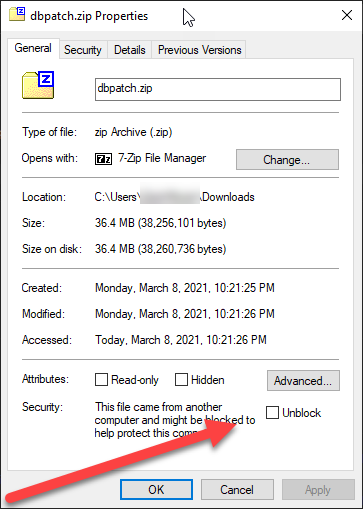

# DB Patch Manager
Database development tool for change control.
v2 has been updated to .NET Core for cross platform support.

DB Patch Manager supports database development across multiple source control branches by tracking the dependencies of each patch and installing them in the correct order. When a developer adds a new patch, that patch depends on all the previous patches recorded in that branch. When branches are merged the `patches.json` file is merged to include all patches and the dependency tree from each branch. 

## Installing
### Windows
dbpatch doesn't yet have working distribution package or an msi.

1. Download the zip from the latest Release.
2. Right click on the zip in Explorer and open the Properties dialog. Click the checkbox to Unblock the zip and then click OK. If you do not see an Unblock checkbox near the bottom of the dialog, then click OK and go to the next step.
3. Unzip the zip file into a folder where you wish to install it. For example `C:\Program Files\dbpatch`
4. Add the folder to your PATH.



### Linux
dbpatch doesn't yet have working distribution packages.

### Prerequisites
* .NET 5
* wget
* unzip

```
wget -qO- https://github.com/ormico/dbpatchmanager/releases/latest/download/install-dbpatch.sh | bash
```

or

```
wget -q https://github.com/ormico/dbpatchmanager/releases/latest/download/install-dbpatch.sh -O install-dbpatch.sh
chmod +x install-dbpatch.sh
./install-dbpatch.sh
rm install-dbpatch.sh
```

If you install dbpatch to somewhere other than `/usr/local/lib/dbpatch` you may need to modify `/usr/local/lib/dbpatch/dbpatch` This file is a shell script which wraps the call to the .net commandline which is used to run dbpatch.dll.

If you wish to install a version other than latest, each Release comes with an install shell script specific for that version starting with v2.1.1

## Build
Database changes are deployed using the `build` command. DB Patch Manager will check the database to determine which patches have already been installed before installing new patches in the correct order.

## Create new db project
```MyProject> dbpatch init --dbtype sqlserver```

This will create a new project file named `patches.json` and initilize it to the SQL Server plugin.

Create a new file named `patches.local.json` When you are a adding files to source control, do not add this file. Open this file in a text editor and add your connecton string something like:

```
{
    "ConnectionString": "Server=.;Database=TestDatabase;Trusted_Connection=True;"
}
```

Each developer would enter their local connection string. When deploying, you would enter the production server's connection string.

## Add a database patch
```MyProject> dbpatch addpatch -n TestPatch```

Creates a folder for the patch in `...\MyProject\Patches\` and adds the patch to the patches.json file. The folder is named using a date time string and a random number and the name. For example something like `201708011412-2403-testpatch`. User can place .sql files in the patch folder and they will be run when the patch is applied. If the user includes more than one patch file, they are run in alphabetical order.

## Add a database code item
Code items are database items that are applied on each build instead of only once like patches. Typically code items are Stored Procedures, Functions, Views, and Triggers.

To add a new stored procedure create a file in the `code` folder. The new file can be named whatever you want and follow whatever naming scheme you want, but the file extension must the code file type. So a stored procedure must file extension must be .sproc.sql For example, you could name it myFunct.sproc.sql

By default, you can also use the file extensions .sproc2.sql or .sproc3.sql if other stored procedures depends on other stored procedures and you want to make sure those stored procedures load first. 

The default list of code file extensions and the order they load is:
* .view.sql - View
* .udf.sql - User Defined Function
* .view2.sql - View
* .udf2.sql - User Defined Function
* .view3.sql - View
* .udf3.sql - User Defined Function
* .sproc.sql - Stored Procedure
* .sproc2.sql - Stored Procedure
* .sproc3.sql - Stored Procedure
* .trigger.sql - Trigger
* .trigger2.sql - Trigger
* .trigger3.sql - Trigger

## Build Database
```MyProject> dbpatch build```

Applies all missing patches and runs all code files.

## Database Plugin
[SQL Server Plugin](https://github.com/ormico/dbpatchmanager-sqlserver)
