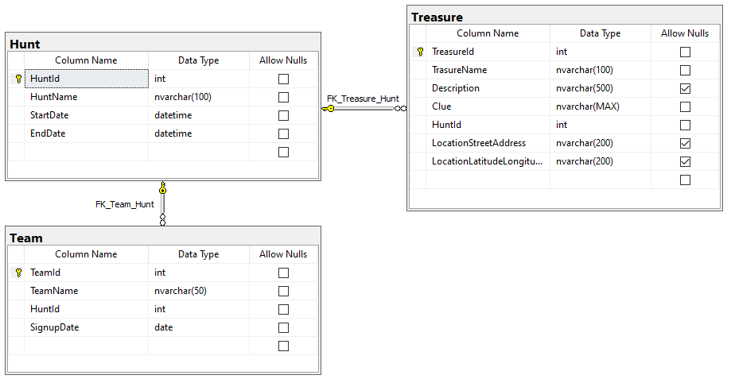

# Tutorial
## Intro
dbpatch is a tool for database change management. The purpose of the tool is to manage database change patches and code assets. These patches and code assets can then be added to and modified in multiple source control branches, merged, and applied to a database in the proper order.

//todo: put this example db project in its own repo

## Installing
Before using dbpatch, it must be installed on a workstation or server.

dbpatch is compiled on .NET 5 which is cross platform and runs on Windows, Linux, and MacOS.

### Installing on Windows
dbpatch doesn't yet have a working distribution package or msi for Windows. Instead use the following instructions.

[.NET 5 runtime](https://dotnet.microsoft.com/download/dotnet/5.0) is a requirement that must be installed before dbpatch can be used.

1. Download the zip from the latest [Release](https://github.com/ormico/dbpatchmanager/releases/latest/download/dbpatch.zip).
2. Right click on the zip in Explorer and open the Properties dialog. Click the checkbox to Unblock the zip and then click OK. If you do not see an Unblock checkbox near the bottom of the dialog, then click OK and go to the next step.
3. Unzip the zip file into a folder where you wish to install it. For example `C:\Program Files\dbpatch`
4. Add the folder to your PATH.


### Installing on Linux
//todo: I tested on an Ubuntu docker container, WSL Ubuntu.
//todo: Need to update sudo usage in instructions.

dbpatch doesn't yet have working distribution packages but can be installed using the included install shell script, or download and view the shell script if you wish to perform the steps manually.

#### Prerequisites
* [.NET 5 runtime](https://dotnet.microsoft.com/download/dotnet/5.0)
* [wget](https://www.gnu.org/software/wget/)
* unzip

#### Steps
Using `wget`, the install shell script can be downloaded and piped to bash to perform the install. This is the quickest way to get dbpatch installed, but it requires trusting the install script.
```bash
wget -qO- https://github.com/ormico/dbpatchmanager/releases/latest/download/install-dbpatch.sh | sudo bash
```
Or, you can download the install script and review it's contents before running.
```bash
#download install-dbpatch.sh
wget -q https://github.com/ormico/dbpatchmanager/releases/latest/download/install-dbpatch.sh -O install-dbpatch.sh
#review install-dbpatch.sh code before executing
cat install-dbpatch.sh
#set install-dbpatch.sh as executable
chmod +x install-dbpatch.sh
#run install-dbpatch.sh
./install-dbpatch.sh
#cleanup
rm install-dbpatch.sh
```

If you install dbpatch to a location other than `/usr/local/lib/dbpatch` you may need to modify `/usr/local/lib/dbpatch/dbpatch`. This file is a shell script which wraps the call to `dotnet dbpatch.dll`.

If you wish to install a version other than latest, each Release comes with an install shell script specific for that version starting with v2.1.1

### Installing on MacOS
I haven't tested this on MacOS yet, but the Linux install instructions should be similar.

## Our Example Developers
In this tutorial, we are going to simulate a multi-developer team working in git and SQL Server. To simulate the team collaborating together in git, we will check the changes attributed to each of our imaginary team members into a different branch. 

Our Imaginary Team:
* Ann - working on user login and privilege system
* Bettie - working on order tracking system
* Casey - initial project setup and PR review and merge

## Creating a new Project (SQL Server)
To get started, create a folder for the the database project. In that folder run `dbpatch init` and specify the `--dbtype` parameter. For this example, specify a MS SQL Server database by using `sqlserver` as the dbtype value.

```bash
mkdir mydb
cd mydb
git init
dbpatch init --dbtype sqlserver
````
This will create the initial starting folders and files which include:
* A `Code` folder for stored procedures, triggers, and other executable parts of a database.
* A `Patches` folder to hold each change script.
* A `patches.json` file which holds the configuration as well as the patch dependency graph.

### Create an empty database
dbpatch requires that a database exists for it to connect to. dbpatch will not create the database for you if it does not exist.

In our example, we are using `sqlcmd` from the command line to create our example database but any SQL Server tool that can execute scripts will do. Execute the following from the command line.

```bash
sqlcmd -S . -Q "create database [dbpatch-example-ann]"
sqlcmd -S . -Q "create database [dbpatch-example-bettie]"
sqlcmd -S . -Q "create database [dbpatch-example-casey]"
```

Because we have three developers on our team, lets give each of them their own database to work in. This simulates each of them having a local database on their own workstation.

### Setting the database Connection String
dbpatch's configution system supports splitting the configuration information into two files. In the previous step, we created `patches.json` using the `init` command. 

In this step, we are going to create the second file `patches.local.json`. Where `patches.json` is checked into source control, `patches.local.json` is designed not to be checked in. The local file is where workstation or server specific settings are specified. When dbpatch runs, these two configuration files are merged with `patches.local.json` overriding any settings made in `patches.json`. While you can override any setting, typically the `ConnectionString` is the most common setting used in the local file.

Create a file in the database project folder named `patches.local.json`. The contents of the file should look like the following, but in place of this connection string specify the connection string to your development database. This is usually a database and server running on your local workstation.

```json
{
    "ConnectionString": "Server=.;Database=dbpatch-example-casey;Trusted_Connection=True;"
}
```

For our imaginary team, lets create a separate local file for each developer. We can swap this file in and out as we simulate commands for each individual. Create the following three files using the correct connection strings for your workstation.

`patches.ann-local.json`
```json
{
    "ConnectionString": "Server=.;Database=dbpatch-example-ann;Trusted_Connection=True;"
}
```

`patches.bettie-local.json`
```json
{
    "ConnectionString": "Server=.;Database=dbpatch-example-bettie;Trusted_Connection=True;"
}
```

`patches.casey-local.json`
```json
{
    "ConnectionString": "Server=.;Database=dbpatch-example-casey;Trusted_Connection=True;"
}
```

### Ignoring patches.local.json and checking in changes in source control
The file `patches.local.json` should be added to `.gitignore` to prevent it from being checked in. In addition to containing sensitive login information, `patches.local.json` is used to customize the login for each environment.

For this example we also want to ignore the other patches local files we created for each imaginary team member.

Create a `.gitignore` file that contains the following entries.

`.gitignore`
```bash
patches.local.json
patches.ann-local.json
patches.bettie-local.json
patches.casey-local.json
```

Check in the files we have created so far (except for the ones that are ignored).

```bash
git stage *
git commit -m "init dbpatch project"
```

## Creating the first Patches

Before allowing the other developers to begin working on the database, Casey wants to add a patch setting up all the database properties and settings.

```dbpatch addpatch -n config-database```

This will add the first patch to `patches.json` and creates a new folder under the `Patches` folder. The patch id is based on the local date and time, a random number, and the patch name pased on the command line. In our example, the patch id is `202103141849-3260-config-database`. 

To find the new patch id list the contents of the `Patches` director and find the newly created patch folder.

In the new patch folder which is named `Patches/202103141849-3260-config-database` create a new SQL file named `config-db.sql`. In this file, enter any `ALTER DATABASE` commands along with any other initial database setup.

Here is a sample of what the file may look like:
```sql
ALTER DATABASE CURRENT SET COMPATIBILITY_LEVEL = 150
GO
ALTER DATABASE CURRENT SET ANSI_NULL_DEFAULT OFF 
GO
ALTER DATABASE CURRENT SET ANSI_NULLS OFF 
GO
ALTER DATABASE CURRENT SET ANSI_PADDING OFF 
GO
ALTER DATABASE CURRENT SET ANSI_WARNINGS OFF 
GO
ALTER DATABASE CURRENT SET ARITHABORT OFF 
GO
ALTER DATABASE CURRENT SET AUTO_CLOSE OFF 
GO
ALTER DATABASE CURRENT SET AUTO_SHRINK OFF
GO
declare @dbname nvarchar(128) = db_name()
EXEC sys.sp_db_vardecimal_storage_format @dbname, N'ON'
GO
...
```

### Note about Patch folders
In patch folders, developers can create any number of database script files. These files will be sorted alphabetically and executed in order against the database. It is a good practice to use just one script file per patch when your database supports this, but if you need to create multiple files another best practice is to name the files in such a way as to both ensure the order and make it obvious to all developers what order the files will execute in. For example, numbering the files ensures the sort order and is obvious to other developers. 

An example of this patter might look like:
```bash
1-create-table.sql
2-add-indexes.sql
```

### Building the Database after Schema additions
After Casey created the first database schema patch, the project should be built in order to update the developer's local database and prove that the patch is correct before checking in the changes.

To build Casey's database, we need to use the correct `patches.local.json` file. Use the following commands to copy `patches.casey-local.json` to `patches.local.json` overwriting any existing file.

```bash
#the following works in Bash and PowerShell
cp patches.casey-local.json patches.local.json
```

To build the project, run the following command:
```bash
dbpatch build
```
Output like the following will be displayed:
```
> dbpatch build

202103141849-3260-config-database
Patches\202103141849-3260-config-database\config-db.sql
```

If there are no errors and the schema in the database has the correct changes, the patch should now be checked in.

```
git stage *
git commit -m "Casey's initial db patch"
```

## Taking a look at the InstalledPatches table
Before moving to the next step let's take a look at the `InstalledPatches` table. 

`dbo.InstalledPatches` was not included in the patch sql that Casey created. `InstalledPatches` is an artifact created by dbpatch and the SQL Server module to track which patches have already been installed in a particular instance of the database. 

Each database module written for dbpatch can implement this tracking in it's own way that is most appropriate for that database type. The SQL Server module does this by creating a table and keeping a record for each patch that is installed. This can be overridden by providing an alternative SQL Script for reading and writing this information.

----> STOPED HERE
//todo: add to intro a description of the example db project we are creating 'scavenger hunt'

## Merging schema changes from another user
Casey now has the database project and repository ready for other developers to start contributing.

Ann is working on the tables for tracking each Scavenger Hunt, the Teams participating, and each Treasure that can be found. Her design looks like this.



Ann begins by creating a branch from main and switching to that new branch.
```
git checkout -b feature/ann-create-hunt-tables
```
The next step is for Ann to create a new Patch and add her schema change file. Because Ann branched from main, she already has the initial patch that Casey made.
```bash
dbpatch addpatch -n create-hunt-tables
```
Listing the contents of `Patches` shows our new Patch folder
```
> ls Patches
    Directory: C:\Users\ormico\Projects\dbpatch-example\Patches

Mode                 LastWriteTime         Length Name
----                 -------------         ------ ----
d----           3/14/2021  6:53 PM                202103141849-3260-config-database
d----           3/14/2021 11:47 PM                202103142347-5594-create-hunt-tables
```

Ann's schema changes
```
CREATE TABLE [dbo].[Hunt]
(
	[HuntId] [int] NOT NULL,
	[HuntName] [nvarchar](100) NOT NULL,
	[StartDate] [datetime] NOT NULL,
	[EndDate] [datetime] NOT NULL,
    CONSTRAINT [PK_Hunt] PRIMARY KEY CLUSTERED([HuntId] ASC)
)
GO

CREATE UNIQUE NONCLUSTERED INDEX [UX_Hunt] ON [dbo].[Hunt]
(
	[HuntName] ASC
)
GO

CREATE TABLE [dbo].[Team]
(
	[TeamId] [int] NOT NULL,
	[TeamName] [nvarchar](50) NOT NULL,
	[HuntId] [int] NOT NULL,
	[SignupDate] [date] NOT NULL,
    CONSTRAINT [PK_Team] PRIMARY KEY CLUSTERED([TeamId] ASC)
)
GO

CREATE UNIQUE NONCLUSTERED INDEX [UX_Team] ON [dbo].[Team]
(
	[HuntId] ASC,
	[TeamName] ASC
)
GO

ALTER TABLE [dbo].[Team] WITH CHECK ADD CONSTRAINT [FK_Team_Hunt] FOREIGN KEY([HuntId])
REFERENCES [dbo].[Hunt] ([HuntId])
GO

ALTER TABLE [dbo].[Team] CHECK CONSTRAINT [FK_Team_Hunt]
GO

CREATE TABLE [dbo].[Treasure]
(
	[TreasureId] [int] NOT NULL,
	[TrasureName] [nvarchar](100) NOT NULL,
	[Description] [nvarchar](500) NULL,
	[Clue] [nvarchar](max) NOT NULL,
	[HuntId] [int] NOT NULL,
	[LocationStreetAddress] [nvarchar](200) NULL,
	[LocationLatitudeLongitude] [nvarchar](200) NULL,
    CONSTRAINT [PK_Treasure] PRIMARY KEY CLUSTERED([TreasureId] ASC)
)
GO

CREATE UNIQUE NONCLUSTERED INDEX [UX_Treasure] ON [dbo].[Treasure]
(
	[HuntId] ASC,
	[TrasureName] ASC
)
GO

ALTER TABLE [dbo].[Treasure] WITH CHECK ADD CONSTRAINT [FK_Treasure_Hunt] FOREIGN KEY([HuntId])
REFERENCES [dbo].[Hunt]([HuntId])
GO

ALTER TABLE [dbo].[Treasure] CHECK CONSTRAINT [FK_Treasure_Hunt]
GO
```


Ann build
```
cp patches.ann-local.json patches.local.json
dbpatch build

202103141849-3260-config-database
Patches\202103141849-3260-config-database\config-db.sql
202103142347-5594-create-hunt-tables
Patches\202103142347-5594-create-hunt-tables\hunt-team-treasure-tables.sql
```


### Building the Database after Schema merge

## Examining InstalledPatches table
//todo: add order by installed date column and show query results
```sqlcmd -S . -d dbpatch-example -Q "select * from installedpatches"```

## Creating the first Database Code entries
### Stored Procedures
### User Defined Functions
### User Defined Function with Dependencies
### Triggers
### Building the Database after Code additions

## Merging Code entries
### Building the Database after Code merge

# Deploying changes to production

# Conclusion
